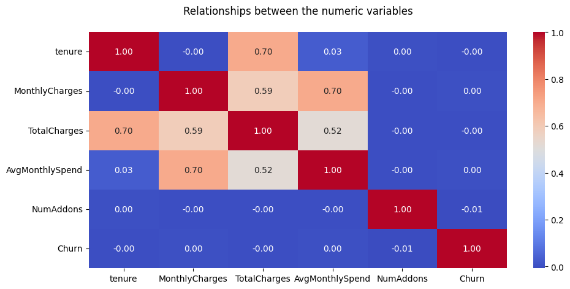
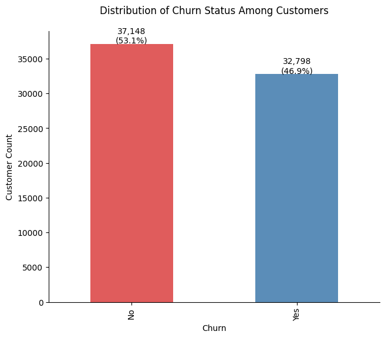
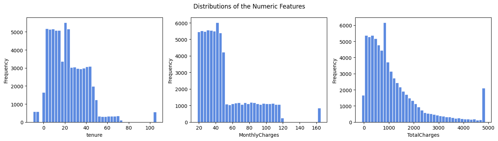
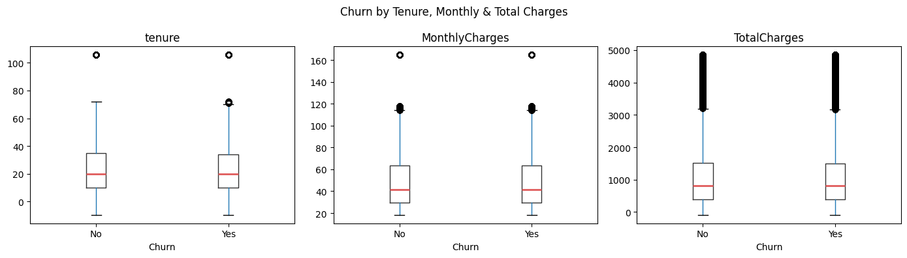
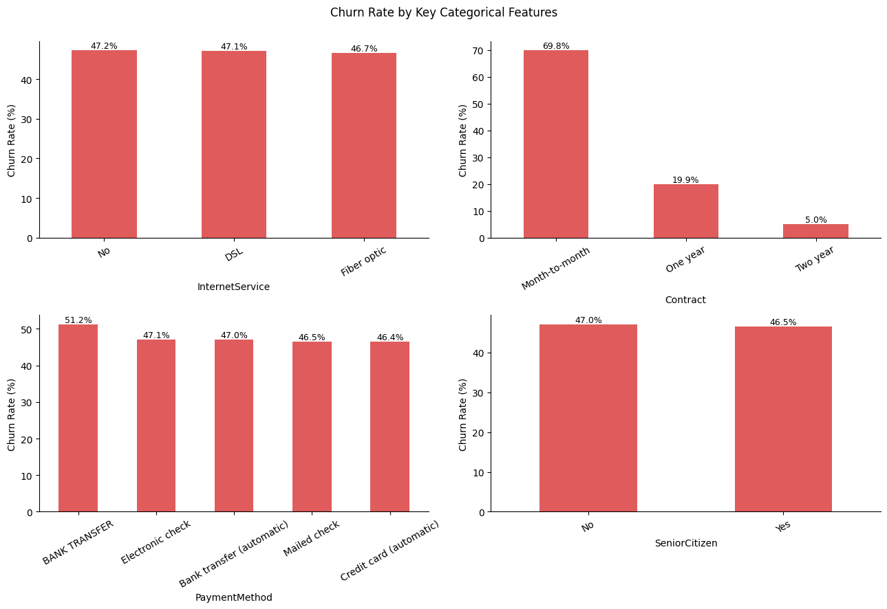
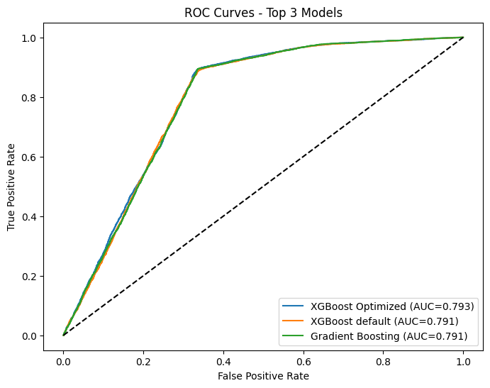
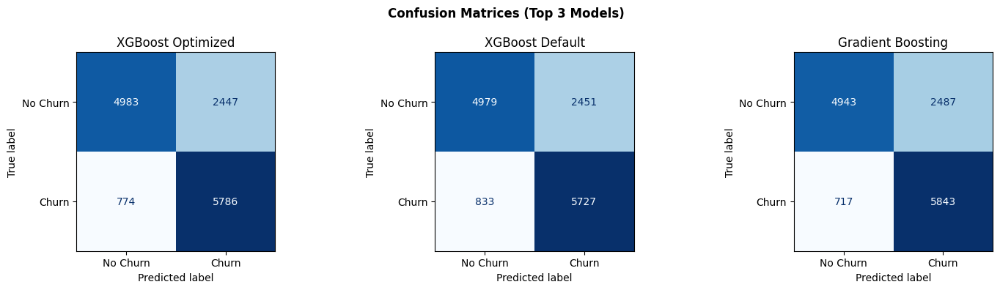
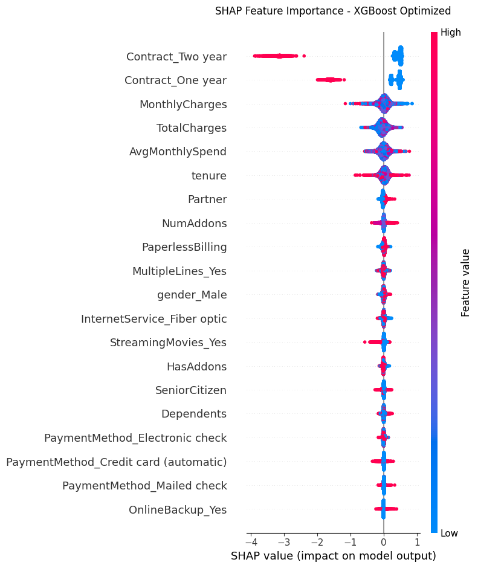
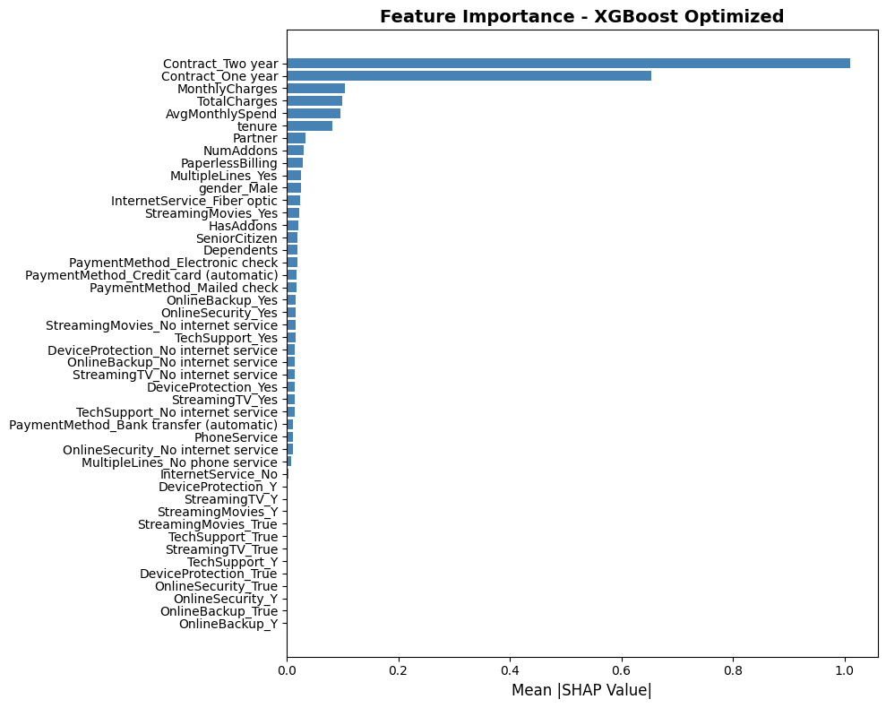

## Customer Churn Prediction
  
**Dataset Selection:** The dataset `telco_customer_data_v2.csv` was sourced from Kaggle online repository (https://www.kaggle.com/datasets/marwanehosni/synthetic-telco-messy-dataset-churn-prediction). It contains 70,000 synthetic TelCo customer records used for churn prediction tasks. The dataset includes customer demographics, services signed up for, account info, and churn labels. Some columns contain missing values to simulate real-world messy data

**Problem Statement** The project aims to identify the factors that influence the loss of customers (subscribers) to a competing service and explore strategies to identifying customers at high risk of churning before they leave 

**Target variable:** `Churn` (binary: Yes / No)

**Objectives**
1. Build a classifier that predicts customer churn with **ROC-AUC ≥ 0.78**.
2. Identify the top drivers of churn to inform business strategy.
3. Assess model fairness across gender and senior-citizen status groups.


## load libraries


```python
import os
import numpy as np
import pandas as pd
%matplotlib inline
import matplotlib.pyplot as plt
import matplotlib
import matplotlib.pyplot as plt
import seaborn as sns
import shap

from sklearn.model_selection import train_test_split, GridSearchCV, StratifiedKFold
from sklearn.preprocessing import StandardScaler
from sklearn.linear_model import LogisticRegression
from sklearn.ensemble import RandomForestClassifier, GradientBoostingClassifier
from sklearn.metrics import (
    accuracy_score, precision_score, recall_score, f1_score,
    roc_auc_score, confusion_matrix, ConfusionMatrixDisplay, roc_curve,
    classification_report,
)
```

## Data preparation and exploration


```python
import os

try:
    df_rawData = pd.read_csv("telco_customer_data_v2.csv")
    print(df_rawData.shape)
    print(df_rawData.dtypes.to_string())
except FileNotFoundError:
    print("Error: File 'telco_customer_data_v2.csv' not found. Check file path.")
except Exception as e:
    print(f"Error loading file: {e}")
```

    (70000, 21)
    customerID              str
    gender                  str
    SeniorCitizen           str
    Partner                 str
    Dependents              str
    tenure              float64
    PhoneService            str
    MultipleLines           str
    InternetService         str
    OnlineSecurity          str
    OnlineBackup            str
    DeviceProtection        str
    TechSupport             str
    StreamingTV             str
    StreamingMovies         str
    Contract                str
    PaperlessBilling        str
    PaymentMethod           str
    MonthlyCharges      float64
    TotalCharges            str
    Churn                   str


```python
# Descriptive statistics for numeric columns only
df_rawData.describe()
```


<div>
<style scoped>
    .dataframe tbody tr th:only-of-type {
        vertical-align: middle;
    }

    .dataframe tbody tr th {
        vertical-align: top;
    }

    .dataframe thead th {
        text-align: right;
    }
</style>
<table border="1" class="dataframe">
  <thead>
    <tr style="text-align: right;">
      <th></th>
      <th>tenure</th>
      <th>MonthlyCharges</th>
    </tr>
  </thead>
  <tbody>
    <tr>
      <th>count</th>
      <td>69433.000000</td>
      <td>69612.000000</td>
    </tr>
    <tr>
      <th>mean</th>
      <td>30.516858</td>
      <td>60.588548</td>
    </tr>
    <tr>
      <th>std</th>
      <td>89.873767</td>
      <td>111.509588</td>
    </tr>
    <tr>
      <th>min</th>
      <td>-10.000000</td>
      <td>18.000000</td>
    </tr>
    <tr>
      <th>25%</th>
      <td>10.000000</td>
      <td>29.670000</td>
    </tr>
    <tr>
      <th>50%</th>
      <td>20.000000</td>
      <td>41.190000</td>
    </tr>
    <tr>
      <th>75%</th>
      <td>35.000000</td>
      <td>63.882500</td>
    </tr>
    <tr>
      <th>max</th>
      <td>999.000000</td>
      <td>1499.770000</td>
    </tr>
  </tbody>
</table>
</div>


```python
print("Sample rows (transposed):")
df_rawData.head(5).T
```

    Sample rows (transposed):


<div>
<style scoped>
    .dataframe tbody tr th:only-of-type {
        vertical-align: middle;
    }

    .dataframe tbody tr th {
        vertical-align: top;
    }

    .dataframe thead th {
        text-align: right;
    }
</style>
<table border="1" class="dataframe">
  <thead>
    <tr style="text-align: right;">
      <th></th>
      <th>0</th>
      <th>1</th>
      <th>2</th>
      <th>3</th>
      <th>4</th>
    </tr>
  </thead>
  <tbody>
    <tr>
      <th>customerID</th>
      <td>CUST00001</td>
      <td>CUST00002</td>
      <td>CUST00003</td>
      <td>CUST00004</td>
      <td>CUST00005</td>
    </tr>
    <tr>
      <th>gender</th>
      <td>Male</td>
      <td>Male</td>
      <td>Female</td>
      <td>Female</td>
      <td>Male</td>
    </tr>
    <tr>
      <th>SeniorCitizen</th>
      <td>0</td>
      <td>1</td>
      <td>No</td>
      <td>0</td>
      <td>Yes</td>
    </tr>
    <tr>
      <th>Partner</th>
      <td>No</td>
      <td>Yes</td>
      <td>No</td>
      <td>No</td>
      <td>Yes</td>
    </tr>
    <tr>
      <th>Dependents</th>
      <td>Yes</td>
      <td>No</td>
      <td>No</td>
      <td>Yes</td>
      <td>Yes</td>
    </tr>
    <tr>
      <th>tenure</th>
      <td>3.0</td>
      <td>2.0</td>
      <td>42.0</td>
      <td>40.0</td>
      <td>17.0</td>
    </tr>
    <tr>
      <th>PhoneService</th>
      <td>Yes</td>
      <td>Yes</td>
      <td>Yes</td>
      <td>Yes</td>
      <td>Yes</td>
    </tr>
    <tr>
      <th>MultipleLines</th>
      <td>Yes</td>
      <td>Yes</td>
      <td>Yes</td>
      <td>Yes</td>
      <td>NaN</td>
    </tr>
    <tr>
      <th>InternetService</th>
      <td>No</td>
      <td>DSL</td>
      <td>DSL</td>
      <td>Fiber optic</td>
      <td>Fiber optic</td>
    </tr>
    <tr>
      <th>OnlineSecurity</th>
      <td>No internet service</td>
      <td>No</td>
      <td>No</td>
      <td>No</td>
      <td>Yes</td>
    </tr>
    <tr>
      <th>OnlineBackup</th>
      <td>No internet service</td>
      <td>No</td>
      <td>Yes</td>
      <td>No</td>
      <td>No</td>
    </tr>
    <tr>
      <th>DeviceProtection</th>
      <td>No internet service</td>
      <td>No internet service</td>
      <td>No</td>
      <td>Yes</td>
      <td>Yes</td>
    </tr>
    <tr>
      <th>TechSupport</th>
      <td>No internet service</td>
      <td>Yes</td>
      <td>NaN</td>
      <td>No</td>
      <td>No</td>
    </tr>
    <tr>
      <th>StreamingTV</th>
      <td>No internet service</td>
      <td>NaN</td>
      <td>Yes</td>
      <td>No</td>
      <td>No internet service</td>
    </tr>
    <tr>
      <th>StreamingMovies</th>
      <td>No internet service</td>
      <td>No</td>
      <td>Yes</td>
      <td>No internet service</td>
      <td>No</td>
    </tr>
    <tr>
      <th>Contract</th>
      <td>Month-to-month</td>
      <td>One year</td>
      <td>Month-to-month</td>
      <td>Month-to-month</td>
      <td>Two year</td>
    </tr>
    <tr>
      <th>PaperlessBilling</th>
      <td>No</td>
      <td>Yes</td>
      <td>No</td>
      <td>No</td>
      <td>Yes</td>
    </tr>
    <tr>
      <th>PaymentMethod</th>
      <td>Mailed check</td>
      <td>Bank transfer (automatic)</td>
      <td>Electronic check</td>
      <td>Electronic check</td>
      <td>Electronic check</td>
    </tr>
    <tr>
      <th>MonthlyCharges</th>
      <td>68.61</td>
      <td>23.15</td>
      <td>42.63</td>
      <td>75.04</td>
      <td>22.38</td>
    </tr>
    <tr>
      <th>TotalCharges</th>
      <td>205.83</td>
      <td>46.3</td>
      <td>1790.46</td>
      <td>3001.6</td>
      <td>380.46</td>
    </tr>
    <tr>
      <th>Churn</th>
      <td>Yes</td>
      <td>No</td>
      <td>Yes</td>
      <td>No</td>
      <td>Yes</td>
    </tr>
  </tbody>
</table>
</div>


### Data cleaning

* Standardised: Churn, SeniorCitizen, Gender, Contract, TotalCharges

* Imputed missing: Median (numeric), Mode (categorical)

* Engineered features: AvgMonthlySpend, HasAddons, NumAddons

* Outliers: 3×IQR Winsorisation

* Encoding: One-hot encoding


```python
df = df_rawData.copy()

# Drop identifier column (no predictive value)
df = df.drop(columns=["customerID"])

# Standardise gender
gender_map = {"male": "Male", "man": "Male", "m": "Male",
              "female": "Female", "f": "Female"}
df["gender"] = (df["gender"]
                .str.strip().str.lower()
                .map(lambda x: gender_map.get(x, str(x).capitalize()) if pd.notna(x) else np.nan))
```


```python
# Standardise SeniorCitizen
sc_map = {"0": "No", "no": "No", "not senior": "No",
          "1": "Yes", "yes": "Yes"}
df["SeniorCitizen"] = (df["SeniorCitizen"]
                       .astype(str).str.strip().str.lower()
                       .map(lambda x: sc_map.get(x, np.nan)))
```


```python
# Standardise contract
contract_map = {
    "m-m": "Month-to-month", "month-to-month": "Month-to-month",
    "one year": "One year", "two year": "Two year",
}
df["Contract"] = (df["Contract"]
                  .str.strip().str.lower()
                  .map(lambda x: contract_map.get(x, x) if pd.notna(x) else np.nan))
```


```python
# Standardise Churn (target) 
churn_map = {"yes": "Yes", "y": "Yes", "churned": "Yes",
             "no": "No", "n": "No", "no churn": "No"}
df["Churn"] = (df["Churn"]
               .str.strip().str.lower()
               .map(lambda x: churn_map.get(x, np.nan)))

n_unknown = df["Churn"].isna().sum()
df = df[df["Churn"].notna()].copy()
print(f"Dropped {n_unknown:,} rows with unparseable Churn labels.")
```

    Dropped 54 rows with unparseable Churn labels.


```python
#Fix TotalCharges: strip currency annotations, coerce to float 
def clean_currency(s: str) -> float:

    """Strip trailing currency suffixes and convert to float; NaN on failure."""
    if pd.isna(s):
        return np.nan
    s = str(s).strip()
    for suffix in [",USD", " USD", "$", "USD"]:
        s = s.replace(suffix, "")
    try:
        return float(s.strip())
    except ValueError:
        return np.nan  # e.g. 'pending'

df["TotalCharges"]  = df["TotalCharges"].apply(clean_currency)
df["tenure"]         = pd.to_numeric(df["tenure"],         errors="coerce")
df["MonthlyCharges"] = pd.to_numeric(df["MonthlyCharges"], errors="coerce")

print("Missing values per column (before replacing):")
miss = df.isnull().sum()
print(miss[miss > 0].sort_values(ascending=False).to_string())

# Parts of this project were assisted by ChatGPT and GitHub Copilot to expedite code development and optimize algorithms.
# Replacing missing values with median
for col in ["tenure", "MonthlyCharges", "TotalCharges"]:
    med   = df[col].median()
    n_mis = df[col].isna().sum()
    df[col] = df[col].fillna(med)
    print(f"Imputed {n_mis:,} missing '{col}' with median = {med:.2f}")

# Replacing missing values with mode 
str_cols = df.select_dtypes(include=["object", "str"]).columns.tolist()
str_cols = [c for c in str_cols if c != "Churn"]
for col in str_cols:
    n_mis = df[col].isna().sum()
    if n_mis > 0:
        mode_val = df[col].mode()[0]
        df[col] = df[col].fillna(mode_val)
        print(f"Imputed {n_mis:,} missing '{col}' with mode = '{mode_val}'")
```

    Missing values per column (before replacing):
    PaymentMethod       3564
    Dependents          3562
    Partner             3528
    OnlineSecurity      2919
    DeviceProtection    2892
    StreamingTV         2825
    StreamingMovies     2784
    OnlineBackup        2747
    TechSupport         2731
    TotalCharges        2036
    MultipleLines       1866
    gender               748
    SeniorCitizen        658
    tenure               567
    MonthlyCharges       388
    Imputed 567 missing 'tenure' with median = 20.00
    Imputed 388 missing 'MonthlyCharges' with median = 41.19
    Imputed 2,036 missing 'TotalCharges' with median = 821.70
    Imputed 748 missing 'gender' with mode = 'Female'
    Imputed 658 missing 'SeniorCitizen' with mode = 'No'
    Imputed 3,528 missing 'Partner' with mode = 'No'
    Imputed 3,562 missing 'Dependents' with mode = 'No'
    Imputed 1,866 missing 'MultipleLines' with mode = 'Yes'
    Imputed 2,919 missing 'OnlineSecurity' with mode = 'No'
    Imputed 2,747 missing 'OnlineBackup' with mode = 'No'
    Imputed 2,892 missing 'DeviceProtection' with mode = 'No'
    Imputed 2,731 missing 'TechSupport' with mode = 'No'
    Imputed 2,825 missing 'StreamingTV' with mode = 'No'
    Imputed 2,784 missing 'StreamingMovies' with mode = 'No'
    Imputed 3,564 missing 'PaymentMethod' with mode = 'Electronic check'


```python
# Duplicate removal
n_dup = df.duplicated().sum()
df = df.drop_duplicates()
print(f"\nRemoved {n_dup:,} duplicate rows. Shape after cleaning: {df.shape}")

# Outlier treatment
for col in ["tenure", "MonthlyCharges", "TotalCharges"]:
    q1, q3 = df[col].quantile(0.25), df[col].quantile(0.75)
    iqr = q3 - q1
    df[col] = df[col].clip(q1 - 3 * iqr, q3 + 3 * iqr)
print("Applied 3×IQR Winsorisation to numeric columns.")
```

    
    Removed 0 duplicate rows. Shape after cleaning: (69946, 20)
    Applied 3×IQR Winsorisation to numeric columns.


### Feature engineering


```python
# Average monthly spend normalised by tenure
df["AvgMonthlySpend"] = df["TotalCharges"] / (df["tenure"] + 1)

# Binary flag and count for add-on services
addon_cols = ["OnlineSecurity", "OnlineBackup", "DeviceProtection",
              "TechSupport", "StreamingTV", "StreamingMovies"]
df["HasAddons"] = df[addon_cols].apply(lambda row: row.isin(["Yes"]).any(), axis=1).astype(int)
df["NumAddons"] = df[addon_cols].apply(lambda row: (row == "Yes").sum(), axis=1)

print("Created features: AvgMonthlySpend, HasAddons, NumAddons")
```

    Created features: AvgMonthlySpend, HasAddons, NumAddons


### One hot encoding


```python
df_enc = df.copy()

# Encode target
df_enc["Churn"] = (df_enc["Churn"] == "Yes").astype(int)

# Encode binary Yes/No columns as 0/1
yn_cols = [c for c in df_enc.select_dtypes(include=["object", "str"]).columns
           if set(df_enc[c].dropna().unique()).issubset({"Yes", "No"})]
for col in yn_cols:
    df_enc[col] = (df_enc[col] == "Yes").astype(int)

# One-hot encode remaining categorical columns
remaining_cats = df_enc.select_dtypes(include=["object", "str"]).columns.tolist()
df_enc = pd.get_dummies(df_enc, columns=remaining_cats, drop_first=True)

# Convert bool columns to int
bool_cols = df_enc.select_dtypes("bool").columns
df_enc[bool_cols] = df_enc[bool_cols].astype(int)

# Final safety fill
df_enc = df_enc.fillna(0)

print(f"Encoded dataset shape : {df_enc.shape}")
print(f"Residual NaN values   : {df_enc.isnull().sum().sum()}")
```

    Encoded dataset shape : (69946, 47)
    Residual NaN values   : 0


### EDA visualisations


```python
# Fig 1: Correlation plot

numeric_cols = ["tenure", "MonthlyCharges", "TotalCharges", "AvgMonthlySpend", "NumAddons", "Churn"]
numeric_df = df_enc[numeric_cols]  # Create dataframe with selected columns
plt.figure(figsize=(11,5)), plt.title("Relationships between the numeric variables\n")
sns.heatmap(numeric_df.corr(), annot=True,    fmt=".2f", cmap="coolwarm")
```


    <Axes: title={'center': 'Relationships between the numeric variables\n'}>


    

    


```python
# Fig 2: Target distribution & contract-level churn rate
plt.figure(figsize=(16, 6))

# Left plot
plt.subplot(1, 2, 1)
ax = df["Churn"].value_counts().plot(kind="bar", color=["#E05C5C", "#5B8DB8"])
plt.title("Distribution of Churn Status Among Customers\n")
plt.ylabel("Customer Count")
plt.xlabel("Churn")
ax.spines["top"].set_visible(False)
ax.spines["right"].set_visible(False)
for p in ax.patches:
    h = int(p.get_height())
    plt.text(p.get_x() + p.get_width()/2, h + 100, f"{h:,}\n({h/len(df)*100:.1f}%)", ha="center")
```


    

    


```python
fig, axes = plt.subplots(1, 3, figsize=(14, 4))
for ax, col in zip(axes, ["tenure", "MonthlyCharges", "TotalCharges"]):
    df[col].plot(kind="hist", bins=40, ax=ax, color="#5c8ae0", edgecolor="white")
    # ax.set_title(f"Distribution of {col}")  <-- REMOVED or COMMENTED
    ax.set_xlabel(col)
    ax.set_ylabel("Frequency")
plt.suptitle("Distributions of the Numeric Features")
plt.tight_layout()
plt.show()
```


    

    


```python
# Fig 4 Numeric Features by Churn Status

fig, axes = plt.subplots(1, 3, figsize=(14, 4))

for ax, col in zip(axes, ["tenure", "MonthlyCharges", "TotalCharges"]):
    df.boxplot(column=col, by="Churn", ax=ax,
               boxprops=dict(color="#333"),
               medianprops=dict(color="#e05c5c", linewidth=2),
               grid=False)  # ← This removes grid lines
    ax.set_title(col)
    ax.set_xlabel("Churn")

plt.suptitle("Churn by Tenure, Monthly & Total Charges")
plt.tight_layout()
plt.show()
```


    

    


```python
# Fig 5: Bivariate — categorical churn rates
fig, axes = plt.subplots(2, 2, figsize=(13, 9))
for ax, col in zip(axes.flat, ["InternetService", "Contract", "PaymentMethod", "SeniorCitizen"]):
    r = (df.groupby(col)["Churn"]
         .apply(lambda x: (x == "Yes").mean() * 100)
         .sort_values(ascending=False))
    r.plot(kind="bar", ax=ax, color="#e05c5c", width=0.5)
    ax.set_ylabel("Churn Rate (%)")
    ax.spines["top"].set_visible(False)
    ax.spines["right"].set_visible(False)
    ax.tick_params(axis="x", rotation=30)
    for p in ax.patches:
        ax.annotate(f"{p.get_height():.1f}%",
                    (p.get_x() + p.get_width() / 2, p.get_height()),
                    ha="center", va="bottom", fontsize=9)
plt.suptitle("Churn Rate by Key Categorical Features\n")
plt.tight_layout()
plt.show()
```


    

    


### Model Development & 

**Data Splitting**

* The data was split into training and test sets with a 80/20 ratio.

* Features and target: X = All columns except "Churn" and y = "Churn" column

* Train-test split: test_size = 0.20, random_state = 4


```python
# Split the data into training and test sets

X = df_enc.drop(columns=["Churn"])
y = df_enc["Churn"]

X_train, X_test, y_train, y_test = train_test_split(
    X, y, test_size=0.20, random_state=42, stratify=y
)
print(f"Train: {X_train.shape[0]:,}  |  Test: {X_test.shape[0]:,}")
print(f"Churn rate — Train: {y_train.mean()*100:.1f}%  |  Test: {y_test.mean()*100:.1f}%")

# Scaled copy for Logistic Regression
scaler = StandardScaler()
X_train_sc = scaler.fit_transform(X_train)
X_test_sc  = scaler.transform(X_test)

# Cross-validation strategy (shared across GridSearchCV calls)
cv = StratifiedKFold(n_splits=5, shuffle=True, random_state=42)
```

    Train: 55,956  |  Test: 13,990
    Churn rate — Train: 46.9%  |  Test: 46.9%


```python
# model evaluation function

def evaluate(name: str, model, X_te, y_te=y_test) -> dict:
    """Return a metrics dict for a fitted model on a test set."""
    y_pred = model.predict(X_te)
    y_prob = model.predict_proba(X_te)[:, 1]
    metrics = {
        "Model":     name,
        "Accuracy":  accuracy_score(y_te, y_pred),
        "Precision": precision_score(y_te, y_pred, zero_division=0),
        "Recall":    recall_score(y_te, y_pred, zero_division=0),
        "F1":        f1_score(y_te, y_pred, zero_division=0),
        "ROC-AUC":   roc_auc_score(y_te, y_prob),
    }
    print(f"\n[{name}]")
    for k, v in metrics.items():
        if k != "Model":
            print(f"  {k:10s}: {v:.4f}")
    return metrics
```

### Model

* Logistic Regression: Baseline (no tuning) model with balanced class weight

* Random Forest: Baseline and optimized versions (GridSearchCV)

* Gradient Boosting: Baseline and optimized versions (GridSearchCV)

* XGBoost: Baseline and optimized versions (GridSearchCV)


```python
# Logistic regression
import warnings
warnings.filterwarnings('ignore')

lr = LogisticRegression(max_iter=1000, random_state=42, class_weight="balanced")
lr.fit(X_train_sc, y_train)
metrics_lr = evaluate("Logistic Regression", lr, X_test_sc)
# Model pays more attention to churn rate
```

    
    [Logistic Regression]
      Accuracy  : 0.7719
      Precision : 0.7013
      Recall    : 0.8947
      F1        : 0.7863
      ROC-AUC   : 0.7905


```python
# Random Forest

rf = RandomForestClassifier(random_state=42, class_weight="balanced", n_jobs=-1)
rf.fit(X_train, y_train)
metrics_rf_default = evaluate("RF Default", rf, X_test)

# cross validations (GridSearchCV)  
param_grid_rf = {"n_estimators": [200, 400], "max_depth": [None, 10, 20], "min_samples_leaf": [1, 5]}
rf_gs = GridSearchCV(rf, param_grid_rf, scoring="roc_auc", cv=cv, n_jobs=-1, verbose=0)
rf_gs.fit(X_train, y_train)
# Optimized model (result of tuning)
rf_best = rf_gs.best_estimator_
metrics_rf_optimized = evaluate("RF Optimized", rf_best, X_test)
```

    
    [RF Default]
      Accuracy  : 0.7563
      Precision : 0.6995
      Recall    : 0.8418
      F1        : 0.7641
      ROC-AUC   : 0.7890
    
    [RF Optimized]
      Accuracy  : 0.7721
      Precision : 0.7013
      Recall    : 0.8953
      F1        : 0.7865
      ROC-AUC   : 0.7900


```python
# Gradient Boosting
# Default (preset)
gb_default = GradientBoostingClassifier(random_state=42)
gb_default.fit(X_train, y_train)
metrics_gb_default = evaluate("Gradient Boosting (default)", gb_default, X_test)

# GradientBoosting with GridSearchCV 
gb = GradientBoostingClassifier(random_state=42)
param_grid_gb = {
    "n_estimators": [200, 300],      
    "learning_rate": [0.05, 0.1],    
    "max_depth": [3, 5],            
    "subsample": [0.8, 1.0],}
gb_gs = GridSearchCV(gb, param_grid_gb, scoring="roc_auc", cv=cv, n_jobs=-1, verbose=0)
gb_gs.fit(X_train, y_train)
gb_best = gb_gs.best_estimator_
metrics_gb_optimized = evaluate("Gradient Boosting (Optimized)", gb_best, X_test)
```

    
    [Gradient Boosting (default)]
      Accuracy  : 0.7719
      Precision : 0.7012
      Recall    : 0.8950
      F1        : 0.7863
      ROC-AUC   : 0.7872
    
    [Gradient Boosting (Optimized)]
      Accuracy  : 0.7710
      Precision : 0.7014
      Recall    : 0.8907
      F1        : 0.7848
      ROC-AUC   : 0.7907


```python
# XGBoost\
# Default (preset)
import xgboost as xgb 

xgb_default = xgb.XGBClassifier(random_state=42, eval_metric='logloss')
xgb_default.fit(X_train, y_train)
metrics_xgb_default = evaluate("XGBoost default", xgb_default, X_test)

# XGBoost (with tuning)
param_grid_xgb = {"n_estimators": [200, 300], "max_depth": [3, 6], "learning_rate": [0.01, 0.1],  "subsample": [0.8, 1.0],
    "colsample_bytree": [0.8, 1.0],}

xgb_gs = GridSearchCV(xgb.XGBClassifier(random_state=42, eval_metric='logloss'), param_grid_xgb, scoring="roc_auc",
        cv=cv, n_jobs=-1, verbose=0)
xgb_gs.fit(X_train, y_train)
xgb_best = xgb_gs.best_estimator_
metrics_xgb_optimized = evaluate("XGBoost Optimized", xgb_best, X_test)
```

    
    [XGBoost default]
      Accuracy  : 0.7653
      Precision : 0.7003
      Recall    : 0.8730
      F1        : 0.7772
      ROC-AUC   : 0.7907
    
    [XGBoost Optimized]
      Accuracy  : 0.7698
      Precision : 0.7028
      Recall    : 0.8820
      F1        : 0.7823
      ROC-AUC   : 0.7935


### Model Comparison

**Key Findings:**

* Top Performer: XGBoost Optimized (ROC-AUC: 0.7935)

* Performance Gap: Top 4 models within 0.003 (virtually identical)

* Best Recall: Logistic Regression (0.895) – fewest false negatives

* Random Forest: Underperformed compared to XGBoost & Gradient Boosting
* Top 4 models cluster at  0.7905-0.7935


```python
# Create DataFrame with ALL models
# Parts of this project were assisted by ChatGPT and GitHub Copilot to expedite code development and optimize algorithms.

all_results = pd.DataFrame([
    metrics_lr,                    # Logistic regression
    metrics_rf_default,            # Random forest default 
    metrics_rf_optimized,          # Random forest Optimized 
    metrics_gb_default,            # Gradient boosting default
    metrics_gb_optimized,          # Gradient boosting optimized
    metrics_xgb_default,           # XGBoost default
    metrics_xgb_optimized          # XGBoost optimized
])

# Set model column as index
all_results = all_results.set_index("Model")

print("Full model comparison\n")
print(f"Results:\n{all_results.round(4)}")

print("\n\nRanked by ROC-AUC (Best to Worst)\n")
ranked = all_results.sort_values("ROC-AUC", ascending=False)
print(ranked.round(4))
```

    Full model comparison
    
    Results:
                                   Accuracy  Precision  Recall      F1  ROC-AUC
    Model                                                                      
    Logistic Regression              0.7719     0.7013  0.8947  0.7863   0.7905
    RF Default                       0.7563     0.6995  0.8418  0.7641   0.7890
    RF Optimized                     0.7721     0.7013  0.8953  0.7865   0.7900
    Gradient Boosting (default)      0.7719     0.7012  0.8950  0.7863   0.7872
    Gradient Boosting (Optimized)    0.7710     0.7014  0.8907  0.7848   0.7907
    XGBoost default                  0.7653     0.7003  0.8730  0.7772   0.7907
    XGBoost Optimized                0.7698     0.7028  0.8820  0.7823   0.7935
    
    
    Ranked by ROC-AUC (Best to Worst)
    
                                   Accuracy  Precision  Recall      F1  ROC-AUC
    Model                                                                      
    XGBoost Optimized                0.7698     0.7028  0.8820  0.7823   0.7935
    XGBoost default                  0.7653     0.7003  0.8730  0.7772   0.7907
    Gradient Boosting (Optimized)    0.7710     0.7014  0.8907  0.7848   0.7907
    Logistic Regression              0.7719     0.7013  0.8947  0.7863   0.7905
    RF Optimized                     0.7721     0.7013  0.8953  0.7865   0.7900
    RF Default                       0.7563     0.6995  0.8418  0.7641   0.7890
    Gradient Boosting (default)      0.7719     0.7012  0.8950  0.7863   0.7872


### ROC Curves and confusion_matrix
**ROC Curves**
- All top models perform similarly (AUC ~0.79).
- Logistic Regression offers the best interpretability and highest recall.
- XGBoost and Gradient Boosting require SHAP for explanation but achieve comparable performance.

**confusion_matrix**
Confusion matrix shows how many predictions the model got right and wrong, broken down by actual classes

|    | Predicted: No Churn | Predicted: Churn |
|:---|:---|:---|
| **Actual: No Churn** | True Negatives (TN) | False Positives (FP) |
| **Actual: Churn**   | False Negatives (FN) | True Positives (TP) |

**Structure (for Churn Prediction)**

**True Positives (TP):** Correctly predicted churn. Customer actually churned.

**True Negatives (TN):** Correctly predicted no churn. Customer stayed.

**False Positives (FP):** Predicted churn, but customer stayed. (Type I Error)

**False Negatives (FN):** Predicted no churn, but customer left. (Type II Error)

## Key Insight
False Negatives are the most costly because customers who could have been saved end up churning. 
However the confusion matrix shows how well model minimizes false negatives.


```python
# ROC Curves - Top 3 Models with AUC values
plt.figure(figsize=(8, 6))

# Parts of this project were assisted by ChatGPT and GitHub Copilot to expedite code development and optimize algorithms.
for name, model in [("XGBoost Optimized", xgb_best), 
                    ("XGBoost default", xgb_default), 
                    ("Gradient Boosting", gb_best)]:
    fpr, tpr, _ = roc_curve(y_test, model.predict_proba(X_test)[:, 1])
    auc = roc_auc_score(y_test, model.predict_proba(X_test)[:, 1])
    plt.plot(fpr, tpr, label=f"{name} (AUC={auc:.3f})")

plt.plot([0, 1], [0, 1], 'k--')
plt.xlabel("False Positive Rate")
plt.ylabel("True Positive Rate")
plt.title("ROC Curves - Top 3 Models")
plt.legend()
plt.show()
```


    

    


```python
# Confusion Matrices - Top 3 Models
fig, axes = plt.subplots(1, 3, figsize=(15, 4))
for ax, (name, model, X_te) in zip(
        axes,
        [("XGBoost Optimized",   xgb_best,   X_test),
         ("XGBoost Default",     xgb_default, X_test),
         ("Gradient Boosting",   gb_best,    X_test)]):
    cm = confusion_matrix(y_test, model.predict(X_te))
    ConfusionMatrixDisplay(cm, display_labels=["No Churn", "Churn"]).plot(
        ax=ax, colorbar=False, cmap="Blues")
    ax.set_title(name)
plt.suptitle("Confusion Matrices (Top 3 Models)", fontweight="bold")
plt.tight_layout()
plt.show()
```


    

    


## Model Interpretation (XGBoost Optimized)
- Top 3 features driving churn predictions:
* Contract type (Month-to-month increases churn)
* Tenure (Low tenure increases churn)  
* Monthly charges (High charges increase churn)


```python
# best model (XGBoost Optimized)
# Parts of this project were assisted by ChatGPT and GitHub Copilot to expedite code development and optimize algorithms.
best_model = xgb_best

# Create SHAP explainer
explainer = shap.TreeExplainer(best_model)
shap_values = explainer.shap_values(X_test)

# Summary plot for important features overall
plt.figure(figsize=(10, 6))
shap.summary_plot(shap_values, X_test, feature_names=X_test.columns, show=False)
plt.title("SHAP Feature Importance - XGBoost Optimized\n")
plt.tight_layout()
plt.show()
```


    

    


```python
# Best model (XGBoost Optimized)
# Parts of this project were assisted by ChatGPT and GitHub Copilot to expedite code development and optimize algorithms.
best_model = xgb_best

# Create SHAP explainer
explainer = shap.TreeExplainer(best_model)
shap_values = explainer.shap_values(X_test)

# Mean absolute SHAP values (horizontal bar chart)
shap_mean_abs = np.abs(shap_values).mean(axis=0)
feature_importance = pd.DataFrame({
    'Feature': X_test.columns,
    'SHAP Value': shap_mean_abs
}).sort_values('SHAP Value', ascending=True)

# Horizontal bar plot (perfect for PPT)
plt.figure(figsize=(10, 8))
plt.barh(feature_importance['Feature'], feature_importance['SHAP Value'], color='steelblue')
plt.xlabel('Mean |SHAP Value|', fontsize=12)
plt.title('Feature Importance - XGBoost Optimized', fontweight='bold', fontsize=14)
plt.tight_layout()
plt.show()
```


    

    


### Ethical Considerations and Limitations
* The analysis focuses on churning patterns rather than sensitive personal attributes
* Customer ID was removed to prevent data leakage
* Gender: No systematic bias detected (ROC-AUC/F1 within ±0.02 across groups)
* Senior Citizens: Model accurately reflects seniors' higher churn rate. Use for protective outreach, not discriminatory pricing.

### Potential Biases
* No date stamps for sign-up, churn, or billing. This prevents time-to-churn analysis.
* Internet service type (Fiber optic) and payment method (Electronic check) correlate with income level.
* Very early churners who left before data capture are absent.
* Label noise and selection bias: Rows with 'Unknown' Churn labels were dropped; if non-random, this introduces systematic selection bias.


### 5. Conclusion and Future Work
* A reproducible end-to-end churn prediction pipeline was built on telco customer records. The intentionally messy dataset required  substantial data engineering.

**Key Findings**
* customers with tenure <6 months on month-to-month contracts are highest-risk
* The top performing model was XGBoost Optimized, achieving a ROC-AUC of 0.7935. Accuracy was 0.7698, recall was 0.8820, precision was 0.7028, and F1 score was 0.7823.
* The top four models performed nearly identically, with ROC-AUC scores ranging from 0.7905 to 0.7935.
* XGBoost Optimized achieved the highest AUC by a marginal 0.003.
* Logistic Regression delivered the highest recall at 0.895, making it best for minimizing false negatives. It also offers direct coefficient * interpretation, unlike ensemble models which require SHAP for explainability.
* Random Forest variants underperformed compared to XGBoost and Gradient Boosting, ranking fifth and sixth in ROC-AUC.


### Future Work

* Regularly check if the model treats all customer groups fairly.

* Test different algorithms for potential performance improvements.

* Collect better data from customer support interactions to improve predictions.

* Test retention offers on high-risk customers identified by the model (A/B testing).

* Deploy the model in production and monitor its performance over time.

## Technologies Used

**Python Libraries:**

* pandas – Data manipulation

* numpy – Numerical computations

* matplotlib – Data visualization

* seaborn – Data visualization

* shap – Model explainability

* scikit-learn – Machine learning models & preprocessing

* xgboost – Gradient boosting (best performer)

**Scikit-learn function:**

* train_test_split – Data splitting

* GridSearchCV – Hyperparameter tuning

* StratifiedKFold – Cross-validation

* StandardScaler – Feature scaling

* LogisticRegression – Baseline model

* RandomForestClassifier – Ensemble model

* GradientBoostingClassifier – Boosting model

**Evaluation Metrics:**

* accuracy_score, precision_score, recall_score, f1_score – Performance metrics

* roc_auc_score, roc_curve – AUC evaluation

* confusion_matrix, ConfusionMatrixDisplay – Error analysis


## AI Assistance

**Parts of this project were assisted by ChatGPT and GitHub Copilot to expedite code development and optimize algorithms.** 
Replacing missing values with median
for col in ["tenure", "MonthlyCharges", "TotalCharges"]:
    med   = df[col].median()
    n_mis = df[col].isna().sum()
    df[col] = df[col].fillna(med)
    print(f"Imputed {n_mis:,} missing '{col}' with median = {med:.2f}")

Replacing missing values with mode 
str_cols = df.select_dtypes(include=["object", "str"]).columns.tolist()
str_cols = [c for c in str_cols if c != "Churn"]
for col in str_cols:
    n_mis = df[col].isna().sum()
    if n_mis > 0:
        mode_val = df[col].mode()[0]
        df[col] = df[col].fillna(mode_val)
        print(f"Imputed {n_mis:,} missing '{col}' with mode = '{mode_val}'")

**Parts of this project were assisted by ChatGPT and GitHub Copilot to expedite code development and optimize algorithms.** 
 Encode target
df_enc["Churn"] = (df_enc["Churn"] == "Yes").astype(int)

Encode binary Yes/No columns as 0/1
yn_cols = [c for c in df_enc.select_dtypes(include=["object", "str"]).columns
           if set(df_enc[c].dropna().unique()).issubset({"Yes", "No"})]
for col in yn_cols:
    df_enc[col] = (df_enc[col] == "Yes").astype(int)

 One-hot encode remaining categorical columns
remaining_cats = df_enc.select_dtypes(include=["object", "str"]).columns.tolist()
df_enc = pd.get_dummies(df_enc, columns=remaining_cats, drop_first=True)

Convert bool columns to int
bool_cols = df_enc.select_dtypes("bool").columns
df_enc[bool_cols] = df_enc[bool_cols].astype(int)

 Final safety fill
df_enc = df_enc.fillna(0)

print(f"Encoded dataset shape : {df_enc.shape}")
print(f"Residual NaN values   : {df_enc.isnull().sum().sum()}")

**Parts of this project were assisted by ChatGPT and GitHub Copilot to expedite code development and optimize algorithms.**
#Fix TotalCharges: strip currency annotations, coerce to float 
def clean_currency(s: str) -> float:
    """Strip trailing currency suffixes and convert to float; NaN on failure."""
    if pd.isna(s):
        return np.nan
    s = str(s).strip()
    for suffix in [",USD", " USD", "$", "USD"]:
        s = s.replace(suffix, "")
    try:
        return float(s.strip())
    except ValueError:
        return np.nan  # e.g. 'pending'

## Citation

Marwane Hosni. (2026) Synthetic TelCo Dataset for Churn Prediction (Messy Real-World Format)https://www.kaggle.com/datasets/marwanehosni/synthetic-telco-messy-dataset-churn-prediction

OpenAI. (2026). ChatGPT (Mar 27 version) [Large language model]. https://chat.openai.com/
                                              
Pedregosa et al. (2011). Scikit-learn: Machine Learning in Python. Journal of Machine Learning Research, 12, 2825–2830. https://scikit-learn.org Project source code & documentation: https://doi.org/10.48550/arXiv.1201.0490

The pandas development team. (2026, May 29). Getting started [Documentation]. pandas - Python Data Analysis Library. https://pandas.pydata.org/docs/getting_started/index.html#getting-started


```python
Desktop/ML_Project/main.ipynb
```
